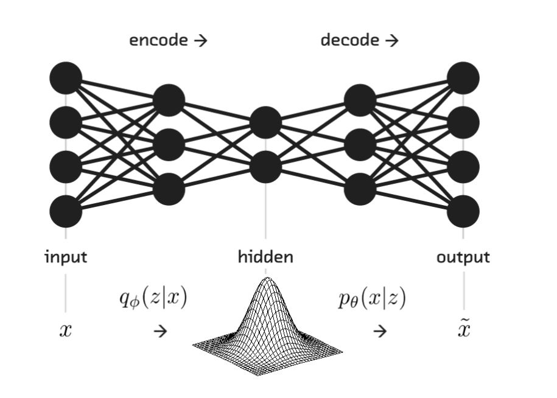
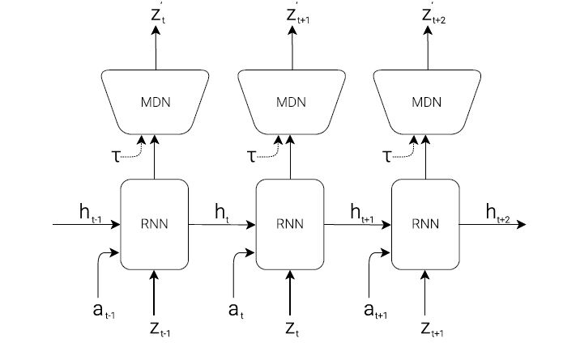
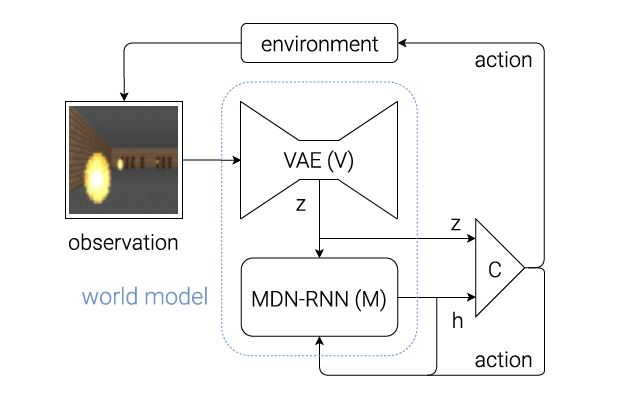
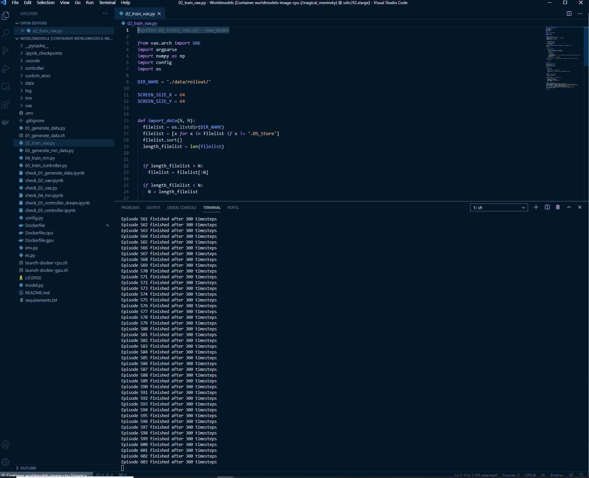
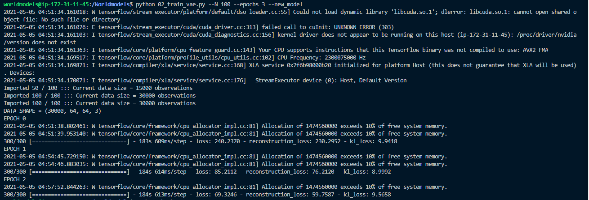
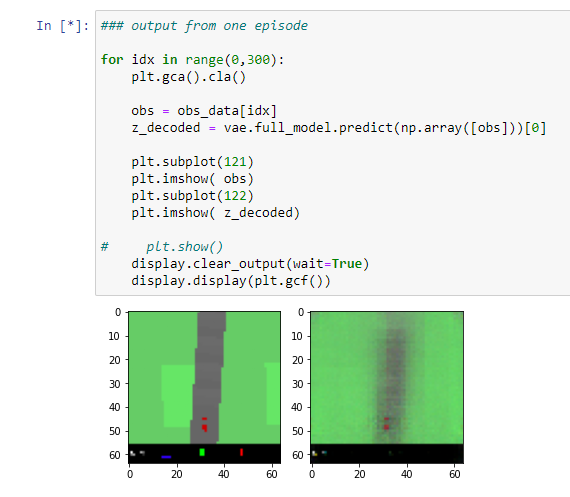
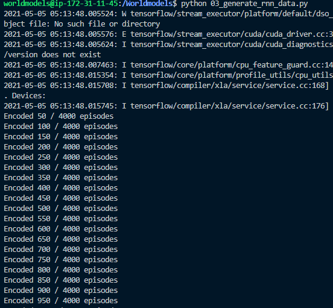
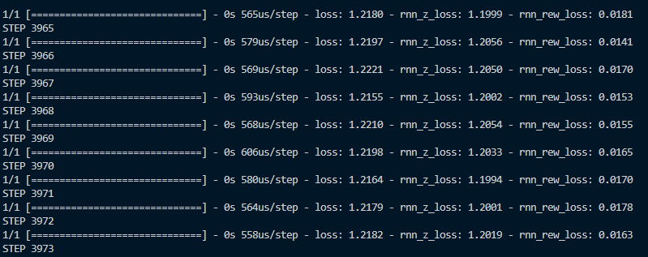
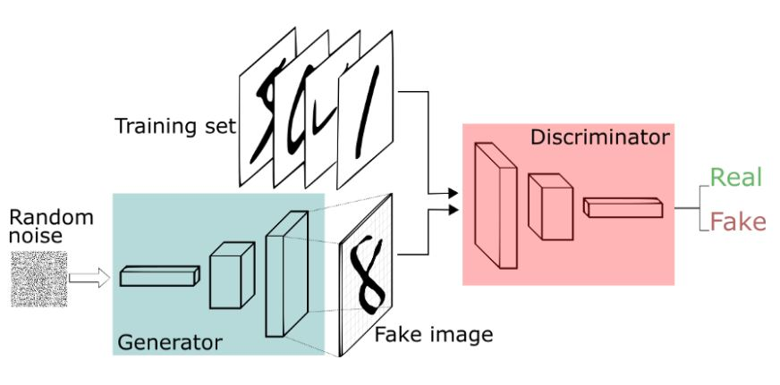
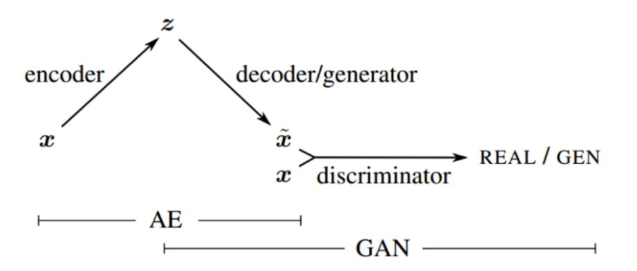

                                                               Project-World Models 
                                                  - Can agents learn inside of their own dreams?
                                                               - Submitted by:
                                                            Hemanth Grandhi- hg2315,
                                                            Deepankar Dixit - dd2943,
                                                            Divya Gupta- dg3483
                                                                 –May, 2021–
**Keywords: **
Model based Reinforcement learning , Recurrent neural network architecture (MDN-RNN), Variational autoencoder (VAE), Controller, Co-variance matrix adaptation evolution strategy (CMA-ES), Generative Adversarial neural network, VAE-GAN model

**Contents-:  **
1)  4-page report of the technique (a model-based RL) 
2)  Training V, M and C model 
3)  Issues faced while training above Agent 
4)  Results of training 
5)  A new approach that combines the VAE with a GAN 
6)  Problem with VAE-GAN implementation 
7)  Comparison between VAE and VAE-GAN 
8)  Conclusion 
9)  References 

**4-page report of the technique (a model-based RL) **

**Reinforcement learning** 
&nbsp;&nbsp;&nbsp;&nbsp;&nbsp;Reinforcement learning is concerned with how to go about making decisions and taking sequential actions in a specific environment to maximize a reward. Backed by computing power, it can explore different strategies (or “policies” in the Reinforcement Learning literature) much faster than we can. On other hand, lack of prior knowledge that humans bring to new situations and environments, it tends to explore many more policies than a human would before finding an optimal one. 

**Model-based and Model-free Reinforcement Learning** 
&nbsp;&nbsp;&nbsp;&nbsp;&nbsp;A model-based reinforcement learning attempts to overcome the issue of a lack of prior knowledge by enabling the agent, whether this agent happens to be a robot in the real world, an avatar in a virtual one, or just a piece software that take actions, to construct a functional representation of its environment. Its potential impact is enormous. As AI becomes more complex and adaptive, extending beyond a focus on classification and representation toward more human-centered capabilities, model-based reinforcement learning will almost certainly play an essential role in shaping these frontiers.  

&nbsp;&nbsp;&nbsp;&nbsp;&nbsp;A model has a very specific meaning in reinforcement learning. It refers to the different dynamic states of an environment and how these states lead to a reward. Model-based reinforcement learning entails constructing such models. It tends to emphasize on the planning part. By leveraging the information it’s learned about its environment, model-based RL can plan rather than just react, even simulating sequences of actions without having to directly perform them in the actual environment. It incorporates a model of the agent’s environment, specifically one that influences how the agent’s overall policy is determined. Advantages of using Model-based reinforcement learning is it can be transferable to other goals and task. Learning a single policy is good for one task but if we can predict the dynamics of environment, we can generalize those insights to multiple tasks. On the other hand its disadvantage are that we have to learn both the policy as well as model which gives two different source of approximation error and it is computationally demanding.  

&nbsp;&nbsp;&nbsp;&nbsp;&nbsp;Model-free reinforcement learning, conversely, forgoes this environmental information and only concerns itself with determining what action to take given a specific state. As a result it only tends to emphasize on learning.  

&nbsp;&nbsp;&nbsp;&nbsp;&nbsp;Difference between model-based and model-free can be understood by real world analogy. In navigation problem, we keep track of all the routes we have taken to begin creating a map of the area. Map would be incomplete but will still help us to plan the course ahead of time to avoid certain neighborhood while still optimizing for most direct route. We can think of it as model based approach. Another option is we would simply keep track of locations we visited and actions we have taken, ignoring the details of routes. When ever we find oneself in location we visited, we favour the directional choice that lead to good outcome over to the direction that led to negative outcome. We will not have knowledge of next location we arrive following the decision but we have a simple procedure in place as to what action to be taken at specific location. This approach is what model-free reinforcemnet learning takes. 

**Agent Model** 
&nbsp;&nbsp;&nbsp;&nbsp;&nbsp;In model-based reinforcement learning, agent's model is inspired by our cognitive system. We as humans develop a mental model of the world based on the what we are able to  perceive  with  our  limit  senses. Our brain  only  learns  an  abstract  representation of both spatial and temporal aspects of the information. We can only remember an abstract description of the information. There are evidence that what we perceive at  any  given  moment  is  governed  by  our brain  future  predictions  based  on  internal model.  It is predicting future sensory data given our current motor actions.  We instinctively act on this predictive model and were able to perform reflexive action in face of danger without the need of consciously planning out the course of action. 

&nbsp;&nbsp;&nbsp;&nbsp;&nbsp;World models in similar fashion can be trained in an unsupervised manner to learn a compressed  spatial  and  temporal  representation  of  the  environment.   We  extract  the features  from  the  world  model. That  is used  as  input  to  agents.   We  train  these agents on very compact and simple policy that can solve the required task. We have visual sensory components that compresses what it sees into small representative code. Memory component that make predictions about future codes base on historical information. Decision making component that decides what actions to be taken based only on the representations created by its vision and memory component. These three components Vision (V), Memory(M) and Controller (C) work together closely.  

**Vision (V) component** 
&nbsp;&nbsp;&nbsp;&nbsp;&nbsp;Variational autoencoder (VAE) is used as V component. Agent gets a high dimensional input observation at each time step from environment. These inputs are 2D image frames that is part of a video sequence. The V component learn abstract, compressed representation of each observed input frame. It compresses each frame it receives at time step t into low dimensional latent vector zt. These compressed representation can be used to created original representation.  
 
&nbsp;&nbsp;&nbsp;&nbsp;&nbsp;&nbsp;&nbsp;&nbsp;&nbsp;&nbsp;&nbsp;&nbsp;&nbsp;&nbsp;&nbsp;&nbsp;&nbsp;&nbsp;&nbsp;&nbsp;&nbsp;&nbsp;&nbsp;&nbsp;&nbsp;&nbsp;&nbsp;&nbsp;&nbsp;&nbsp;&nbsp;&nbsp;&nbsp;&nbsp;&nbsp;&nbsp;&nbsp;&nbsp;&nbsp;&nbsp;&nbsp;&nbsp;&nbsp;&nbsp;&nbsp;&nbsp;&nbsp;&nbsp;&nbsp;&nbsp;&nbsp;&nbsp;&nbsp;&nbsp;&nbsp;&nbsp;&nbsp;&nbsp;&nbsp;&nbsp;&nbsp;&nbsp;&nbsp;&nbsp;&nbsp;&nbsp;&nbsp;&nbsp;&nbsp;&nbsp;Fig 1. VAE Architecture 
**Memory (M) component** 
&nbsp;&nbsp;&nbsp;&nbsp;&nbsp;M component is called mixed density network combined with recurrent neural networks. Role of M component is to predict the future. It is expected to produce predictions of z vectors that V models produce. Since we deal with stochastic environment, we train our recurrent neural network to output probability density function p(z) instead of deterministic predictions of z.  p(z) is mixture of Gaussian distributions. Given current and past information, we can train our recurrent neural network to output probability distribution of next latent vector zt+1. More specifically, recurrent neural network will produce model P(zt+1 | at, zt, ht), where at is action taken at time t, ht is hidden state of recurrent neural network at time t. We control model uncertainty by adjusting temperature parameter.  
 
&nbsp;&nbsp;&nbsp;&nbsp;&nbsp;&nbsp;&nbsp;&nbsp;&nbsp;&nbsp;&nbsp;&nbsp;&nbsp;&nbsp;&nbsp;&nbsp;&nbsp;&nbsp;&nbsp;&nbsp;&nbsp;&nbsp;&nbsp;&nbsp;&nbsp;&nbsp;&nbsp;&nbsp;&nbsp;&nbsp;&nbsp;&nbsp;&nbsp;&nbsp;&nbsp;&nbsp;&nbsp;&nbsp;&nbsp;&nbsp;&nbsp;&nbsp;&nbsp;&nbsp;&nbsp;&nbsp;&nbsp;&nbsp;&nbsp;&nbsp;&nbsp;&nbsp;&nbsp;&nbsp;&nbsp;&nbsp;&nbsp;&nbsp;&nbsp;&nbsp;&nbsp;&nbsp;&nbsp;&nbsp;&nbsp;&nbsp;&nbsp;&nbsp;&nbsp;&nbsp;Fig 2. M Component 
&nbsp;&nbsp;&nbsp;&nbsp;&nbsp;We use recurrent neural networks to implement these powerful predictive models. Large recurrent neural networks are highly expressive models that can learn rich spatial and temporal representations of data. However reinforcement learning algorithms is often bottle-necked by the credit assignment problem which make harder for these algorithms to learn millions of weights of a large model. Hence in practice, smaller networks are used to iterate faster to a good policy during training.  

**Controller (C)**  
&nbsp;&nbsp;&nbsp;&nbsp;&nbsp;Controller component determine the course of action taken in order to maximize the expected cumulative reward of the agent during roll-out of the environment. It is made simple and small deliberately and made to train separately from V and M so that most of our agents complexity lies resides in world models( V and M). It is simple single layer linear model that maps zt and ht directly with at at each step.  
&nbsp;&nbsp;&nbsp;&nbsp;&nbsp;&nbsp;&nbsp;&nbsp;&nbsp;&nbsp;&nbsp;&nbsp;**at= Wc [zt ht] + Bc  **
where wc and Bc are weight matrix and bias vector respectively that concatenate input vector [zt ht] with output at. 

&nbsp;&nbsp;&nbsp;&nbsp;&nbsp;Together V, M and C works as follows. Raw observation first processed by V at each time step t to produce zt. The latent vector zt concatenated with M hidden state ht is passed to C. C will output an action vector at for motor control which effects the environment. M will take current vector zt and action vector at as input to update its hidden state to produce ht+1. After running this controller c will return the cumulative_reward during the roll-out.  
 
&nbsp;&nbsp;&nbsp;&nbsp;&nbsp;&nbsp;&nbsp;&nbsp;&nbsp;&nbsp;&nbsp;&nbsp;&nbsp;&nbsp;&nbsp;&nbsp;&nbsp;&nbsp;&nbsp;&nbsp;&nbsp;&nbsp;&nbsp;&nbsp;&nbsp;&nbsp;&nbsp;&nbsp;&nbsp;&nbsp;&nbsp;&nbsp;&nbsp;&nbsp;&nbsp;&nbsp;&nbsp;&nbsp;&nbsp;&nbsp;&nbsp;&nbsp;&nbsp;&nbsp;&nbsp;&nbsp;&nbsp;&nbsp;&nbsp;&nbsp;&nbsp;&nbsp;&nbsp;&nbsp;&nbsp;&nbsp;&nbsp;&nbsp;&nbsp;&nbsp;&nbsp;&nbsp;&nbsp;&nbsp;&nbsp;&nbsp;&nbsp;&nbsp;&nbsp;&nbsp;Fig 3. Agent Model 

&nbsp;&nbsp;&nbsp;&nbsp;&nbsp;We can train large and sophisticated models efficiently, provided we define a well behaved, differential loss functions. Most of the model complexity and model parameters would reside in V and M. Number of parameters in C are minimal in comparison to M and V. This allow us to explore more unconventional ways to train C example, even using evolution strategies (ES) to tackle more challenging RL tasks where credit assignment problem is difficult. Co-variance matrix adaptation evolution strategy (CMA-ES) is used to optimize the parameter C. It works well for solution spaces of up to a few thousand parameters.  

**Car racing experiment** 
&nbsp;&nbsp;&nbsp;&nbsp;&nbsp;In car racing project, we are training large neural network to tackle reinforcement learning tasks. Agent is divided into large world model and small controller model. We first train a large neural network to learn model of Agents world in an unsupervised manner. Then we train small controller model to learn to perform task using world model. Training algorithm of small controller, focus on credit assignment problem on small search space while not sacrificing capacity and expressiveness via large world models. Training the agent through the lens of its world model, It was shown here that agent can learn highly compact policy to perform the task. 

&nbsp;&nbsp;&nbsp;&nbsp;&nbsp;Though we learn a model of the environment using traditional existing model based reinforcement learning, we still train our conroller in actual environment. Here in this experiment, an actual reinforcement learning environment is replaced with the generated one. We trained our controller inside the environment generated by its own internal world model and then transfer this policy back into actual environment. We can produce the sample of probability distribution of zt+1 given the current state and the use those sample as real observations to produce a virtual environment. Adjustments are made in the temperature hyper-parameter of the internal world model to control the amount of uncertainty of the generated environments. This helps to overcome the problem of agents exploiting the imperfections of generated environment. We can also demonstrate that if we can train our agents controller inside of a noisier and more uncertain version of its generated environment successfully, that agent will definitely thrive in the original, cleaner environment  

&nbsp;&nbsp;&nbsp;&nbsp;&nbsp;Using M model to generate a virtual dream environment provides access to all the hidden state of M component to the controller. Hence our agent can efficiently explore ways to directly manipulate the hidden states of the agent engine in its quest to maximize its expected cumulative reward. This is a down side of learning a policy inside a learned dynamics model. Our agent can easily find an adversarial policy that can fool our dynamics model, it’ll find a policy that looks good under our dynamics model, but will fail in the actual environment. This is the reason we do not replace actual environment. Recent solutions combines model based approach with traditional model free reinforcement learning training by first initializing the policy network with learned policy but subsequently, reply on model free methods to fine tune learned policy in actual environment. 

&nbsp;&nbsp;&nbsp;&nbsp;&nbsp;Here in car racing experiment, recurrent neural network M component is used to predict and plan ahead step-by-step and we have used evolution to optimize C. Dynamic MDN-RNN is used as M model to make even more harder for C to exploit its deficiencies. MDN-RNN models the distribution of possible outcome in actual environment rather than merely predicting a deterministic future. Even though actual environment is deterministic, it would in effect approximate it as a stochastic environment. This gives us the advantage of training C in a stochastic version of any environment. We can control the trade-off between realism and exploit-ability by adjusting the temperature hyper-parameter. It also makes it easier to model the logic behind a more complicated environment with discrete random states.  

**Complex environments** 
&nbsp;&nbsp;&nbsp;&nbsp;&nbsp;In any difficult environment, where some parts of world are made available to the agent only when it learns how to strategically navigate through the world. We need iterative training procedures to perform complicated tasks. Here agent is able to explore world and constantly collect new observations to improve and refine its world model over time. An iterative training procedure is as follows.  
1) Initialize M, C with random model parameters. 
2) Roll-out to actual environment N times. Save all actions at and observations xt during roll-outs to storage. 
3) Train M to model P(xt+1, rt+1, at+1, dt+1| xt, at, ht)$ and train C to optimize expected rewards inside of M. 
4) Go back to (2) if task has not been completed. 

&nbsp;&nbsp;&nbsp;&nbsp;&nbsp;In present approach, MDN-RNN that models a probability distribution for the next frame. If it does the poor job, it means that it encounters the part of world that it is not familiar with. In this case, We can reuse M training loss function to encourage curiosity. We flipped the sign of M's loss function in actual environment to encourage the agent to explore the parts of the world that it is not familiar with. New data collected improves the world model. Iterative training  procedure requires M model to also predict the action and reward for the next step. This is useful for more difficult tasks. For instance we require world model to imitate controller that has already learned walking. Once world model absorb the skill of walking, controller can rely on those skills and focus on learning more higher level skill.  

**Scope of improvements in existing techniques** 
&nbsp;&nbsp;&nbsp;&nbsp;&nbsp;We have demonstrated the possibility of training an agent to perform tasks entirely inside of its simulated latent space dream world. This approach offers many practical benefits. For instance to run computationally intensive engines, We may not want to waste cycles training an agent in the actual environment, but instead train the agent as many times as we want inside its simulated environment as training agents in real world are more expensive. Another area is the choice of using and training VAE for V model as a standalone model has its own limitations as it can encodes parts of observation that are not relevant to the task. We can train it with M model that predicts rewards and VAE can learn t focus on learning task relevant areas of the image. But downside of using this technique is that we can not reuse VAE for new tasks without retraining. Future work is needed in replacing small MDN-RNN network with higher capacity models. LSTM based models are not capable of storing all recorded information inside its weighted connections. It suffers from catastrophic forgetting. Recent approach is One Big Net. It collapse C and M into single network and use power play like behavioural replay to avoid forgetting old predictions and control skill when learning new one.  

**Training V, M and C model **

&nbsp;&nbsp;&nbsp;&nbsp;&nbsp;A predictive world model is used extract useful representations of space and time. Using these features as inputs of a controller, we can train a compact and minimal controller to perform a continuous control task such as learning to drive from pixel inputs from top-down car racing environment. Reward is -0.1 every frame and + 1000/N for every track tile visited, where N is total number of tiles in track. For example, if you finished in 732 frames, you reward is 1000-0.1*732= 926.8 points. For good performance, we need to get 900+ points consistently. Track is random every episode. Episode finishes when all tiles are visited. If car go far off the track, then it will get -100 and die. Agent conrol three continuous actions: steering left/right, acceleration and brake.  

&nbsp;&nbsp;&nbsp;&nbsp;&nbsp;First, collect a dataset of 2000 random rollouts of the environment. We have an agent acting randomly to explore the environment multiple times and record the random actions a_t taken and the resulting observtions from the environment. 01_generate_data.py is used to collect this data in folder data\rollout.  
 

&nbsp;&nbsp;&nbsp;&nbsp;&nbsp;We use this dataset to train V to learn a latent space of each frame observed. We encode each frame in low dimentional latent vector z_t by minimizing the difference between a given frame and the reconstructed version of the frame produced by the decoder from z. 02_train_vae.py is used to train over 100 episodes.  
 
 
&nbsp;&nbsp;&nbsp;&nbsp;&nbsp;We can now use our trained V model to pre-process each frame at time t into z_t to train our M model. Pre-processed data, along with the recorded random actions a_t taken, our MDN-RNN can now be trained to model P(zt+1 | at, zt, ht) as a mixture of gaussians. 03_generate_rnn_data.py prepossed data and store in data/series folder. We then train our M component using 04_train_rnn.py  
 
 

&nbsp;&nbsp;&nbsp;&nbsp;&nbsp;World model (V and M) does not have knowledge of actual reward signals from the environment. Its task is simply to compress and predict the sequence of image frames observed. Controler function have access to reward information from the environment. CMA-ES evolutionary algorithm is well suited to optimize parameters inside linear controller model. To train our controller we have use 05_train_controller.py. 
 

&nbsp;&nbsp;&nbsp;&nbsp;&nbsp;To summarize the Car Racing experiment, below are the steps taken: 
1. Collect 2000 rollouts from a random policy. 
2. Train VAE (V) to encode frames into z 2 R32. 
3. Train MDN-RNN (M) to model P(zt+1 | at; zt; ht). 
4. Define Controller (C) as at = Wc [zt ht] + bc. 
5. Use CMA-ES to solve for a Wc and bc that maximizes the expected cumulative reward. 

**Issues faced while training above Agent **
We ran into number of issues from environment setup to training of agent. Some of them are listed below. 
1) Connection with EC2 instance. Permission issues with .pem file.  
2) Issues with VS terminal setup. 
3) Not enough compute and memory resorces to successfully train VAE model. Our Instance were getting killed due to error exceed 10% of free system memory. 
4) After long hours of training, Host system turn to sleep mode and lost connection with remote machine. Thus interrupting the training.  
5) Issues with the abrupt terminataion of EC2 instances due to number of reasons. 
6) Issues with WSL and docker installation and setup in local machines like system requirements constrained, Issues with starting Docker daemon, Issues with building docker immage etc. 

**Results of training **

**A new approach that combines the VAE with a GAN **

**Problem with VAE-GAN implementation **

**Comparison between VAE and VAE-GAN **
 &nbsp;&nbsp;&nbsp;&nbsp;&nbsp;As discussed above VAEs consist of pair of networks that is pair of encoders and decoders. Encoder is responsible for mapping of input x to posterior distributions and decorder is responsible for samplling randomly from these posterior distributions for input vectors. It produce blurry outputs that has to do with how data distributions are recovered and loss functions are calculated in VAEs.  
 
&nbsp;&nbsp;&nbsp;&nbsp;&nbsp;In camparison to VAEs GANs( generative neural networks) consist of two parts. Generative neural network and discriminator neural network. Generative neural network is responsible for taking noise as input and generating samples. Then discriminative neural network is asked to evalute and distinguish the generated samples from training data. The major goal of genrative neural network is to fool the discriminator neural network that is increase the error rate. That can be done by generating samples that appear to be from training data.  

&nbsp;&nbsp;&nbsp;&nbsp;&nbsp;&nbsp;&nbsp;&nbsp;&nbsp;&nbsp;&nbsp;&nbsp;&nbsp;&nbsp;&nbsp;&nbsp;&nbsp;&nbsp;&nbsp;&nbsp;&nbsp;&nbsp;&nbsp;&nbsp;&nbsp;&nbsp;&nbsp;&nbsp;&nbsp;&nbsp;&nbsp;&nbsp;&nbsp;&nbsp;&nbsp;&nbsp;&nbsp;&nbsp;&nbsp;&nbsp;&nbsp;&nbsp;&nbsp;&nbsp;&nbsp;&nbsp;&nbsp;&nbsp;&nbsp;&nbsp;&nbsp;&nbsp;&nbsp;&nbsp;&nbsp;&nbsp;&nbsp;&nbsp;&nbsp;&nbsp;&nbsp;&nbsp;&nbsp;&nbsp;&nbsp;&nbsp;&nbsp;&nbsp;&nbsp;&nbsp;Fig 1. GAN Architecture 
&nbsp;&nbsp;&nbsp;&nbsp;&nbsp;In VAE-GAN model, authors of paper “Autoencoding beyond pixels using a learned similarity metric” suggested GAN discriminator can be used inplace of VAE decoder to learn loss function. Blurriness in VAE is some what related to how VAE's loss function is calculated.  

&nbsp;&nbsp;&nbsp;&nbsp;&nbsp;&nbsp;&nbsp;&nbsp;&nbsp;&nbsp;&nbsp;&nbsp;&nbsp;&nbsp;&nbsp;&nbsp;&nbsp;&nbsp;&nbsp;&nbsp;&nbsp;&nbsp;&nbsp;&nbsp;&nbsp;&nbsp;&nbsp;&nbsp;&nbsp;&nbsp;&nbsp;&nbsp;&nbsp;&nbsp;&nbsp;&nbsp;&nbsp;&nbsp;&nbsp;&nbsp;&nbsp;&nbsp;&nbsp;&nbsp;&nbsp;&nbsp;&nbsp;&nbsp;&nbsp;&nbsp;&nbsp;&nbsp;&nbsp;&nbsp;&nbsp;&nbsp;&nbsp;&nbsp;&nbsp;&nbsp;&nbsp;&nbsp;&nbsp;&nbsp;&nbsp;&nbsp;&nbsp;&nbsp;&nbsp;&nbsp;Fig 1. VAE-GAN Architecture 

The loss function of VAE model is -:  
Lvae= MSE (Dl(xdecoder), Dl(xreal))+ prior  
and loss function of GAN is -: 
LGAN= Ex ~pdata log (D(X)) + Ex ~pmodel log (1-D(X))  

&nbsp;&nbsp;&nbsp;&nbsp;&nbsp;Here the above equations assume the lth layer discriminator have outputs that differ in gaussian manner. As a result, calculating the mean squared error (MSE) between the lth layer outputs gives us the VAE’s loss function. The final output of GAN, D(x), can then be used to calculate its own loss function.  

**Conclusion **

**References **
1) https://medium.com/the-official-integrate-ai-blog/understanding-reinforcement-learning-93d4e34e5698 
2) https://medium.com/applied-data-science/how-to-build-your-own-world-model-using-python-and-keras-64fb388ba459 
3) https://arxiv.org/pdf/1803.10122.pdf 
4) https://towardsdatascience.com/what-the-heck-are-vae-gans-17b86023588a 
5) https://medium.com/@lishuo1/which-one-should-you-choose-gan-or-vae-part-i-da92acb4ab3e#:~:text=They%20are%20both%20generative%20models&text=By%20rigorous%20definition%2C%20VAE%20models,that%20could%20fool%20the%20discriminator. 
